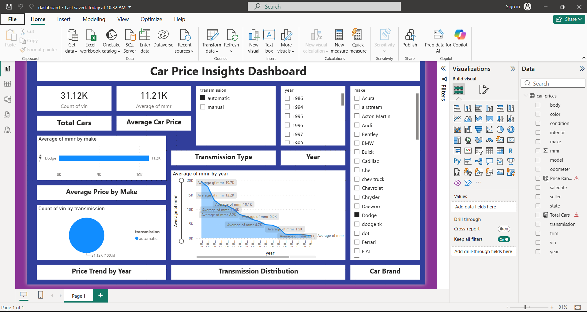
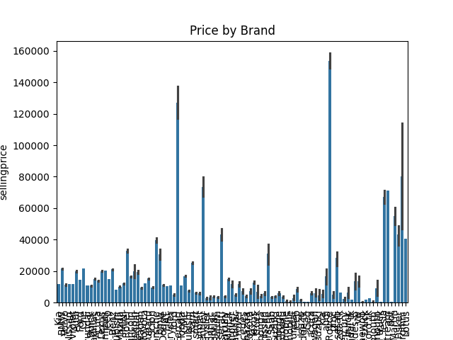
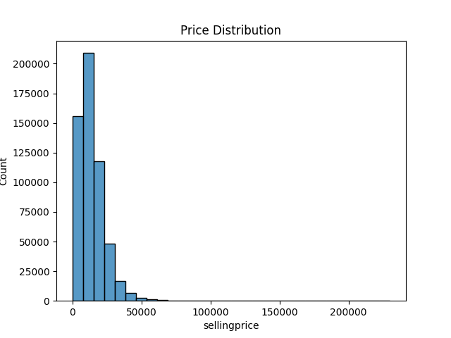
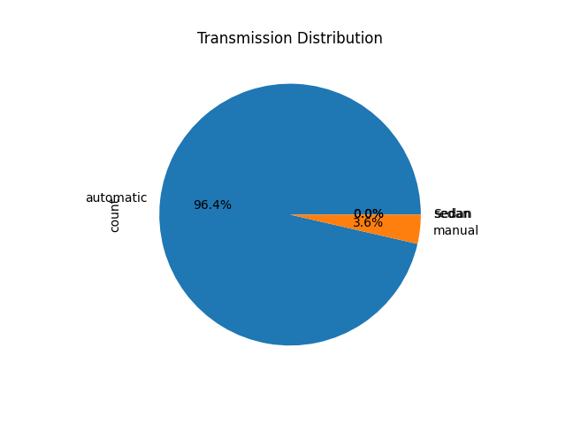

# 🚗 Car Price Insights Dashboard (Task 3)

## 📌 Project Overview

This project is part of the ApexPlanet Data Analytics Internship – Task 3. The objective is to perform deep-dive analysis on car price data and create an interactive Power BI dashboard to generate meaningful business insights using data visualization techniques.

The dashboard provides interactive analysis of car prices, transmission types, brand-wise trends, and yearly price insights.

---

# 🎯 Objectives

* Perform deep-dive analysis on car price data
* Build an interactive Power BI dashboard
* Analyze average prices across different car brands
* Understand transmission distribution and trends
* Visualize yearly price patterns
* Use KPI cards and slicers for interactive reporting
* Create professional business intelligence visuals

---

# 📊 Dataset

### Source:

Kaggle

### Dataset Name:

Car Prices Dataset

### Description:

The dataset contains information related to:

* Car Brand (Make)
* Model
* Selling Price
* Transmission Type
* Manufacturing Year
* Odometer Reading
* Body Type
* State
* Vehicle Information

---

# 🛠 Tools & Technologies Used

* Microsoft Power BI – Interactive Dashboard
* Python – Data Analysis
* Pandas – Data Cleaning & Processing
* Matplotlib – Data Visualization
* CSV Dataset – Data Source
* Git & GitHub – Version Control

---

# 📂 Project Structure

```bash
Task3-DeepDive-Dashboard/
│
├── dashboard/
│   └── dashboard.pbix
│
├── data/
│   └── car_prices.csv
│
├── outputs/
│   ├── Car_Price_Insights.pbix.png
│   ├── price_by_brand.png
│   ├── price_distribution.png
│   ├── transmission.png
│
├── scripts/
│   └── analysis.py
│
└── README.md
```

---

# 📈 Dashboard Features

## 🔹 KPI Cards

* Total Cars
* Average Car Price

## 🔹 Interactive Filters / Slicers

* Car Brand
* Transmission Type
* Manufacturing Year

## 🔹 Visualizations

* Average Price by Brand (Bar Chart)
* Transmission Distribution (Pie Chart)
* Price Trend by Year (Line Chart)
* Interactive Dashboard Layout

---

# 📊 Dashboard Preview

## 🔹 Main Dashboard



---

# 📈 Visualizations

## 🔹 Average Price by Brand



---

## 🔹 Price Distribution



---

## 🔹 Transmission Distribution



---

# 🔍 Key Insights

* Premium car brands show higher average selling prices
* Automatic transmission vehicles dominate the dataset
* Car prices vary significantly across manufacturing years
* Brand-wise analysis highlights pricing differences
* Interactive filters improve dashboard usability and exploration
* Visualization helps identify market and pricing trends effectively

---

# 📌 Conclusion

This project demonstrates how Power BI dashboards and data visualization techniques can be used to perform deep-dive analysis on real-world datasets.

The project helped in understanding:

* Dashboard creation
* Interactive reporting
* KPI analysis
* Data storytelling
* Business intelligence concepts

---

# 🚀 Future Enhancements

* Add advanced business insights
* Include predictive analytics for price estimation
* Improve dashboard responsiveness
* Add more datasets for comparative analysis
* Create advanced Power BI reports

---

# 📌 Internship Task

Completed as part of:

### ApexPlanet Data Analytics Internship – Task 3

### Task Focus:

Deep Dive Analysis & Interactive Dashboarding

---

# 📌 Author

### Anusha Purra

GitHub:
https://github.com/PURRAANUSHA

https://github.com/PURRAANUSHA

